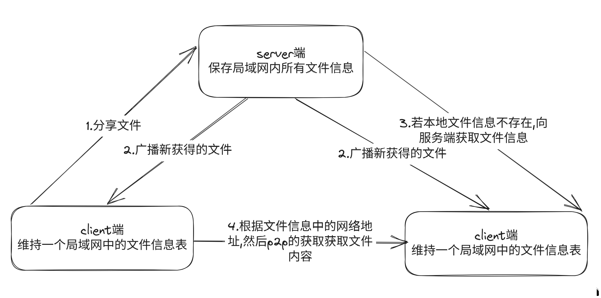
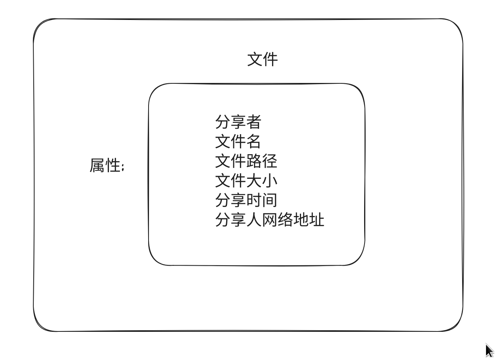

# 局域网文件共享系统

## 架构图


## 实体


## 接口

```go
// 消息ID
const (
	Get uint8 = iota
	Set
	Del
)

请求格式
type Request struct {
	//消息ID
	ID uint8
	//消息的长度
	DataLen uint16
	//消息的内容
	Data []byte
}
```

Get 获取所有的共享文件

Set 创建共享文件, 请求体里面携带一个文件信息的负载

Del 删除共享文件, 请求体里面携带一个文件信息的负载